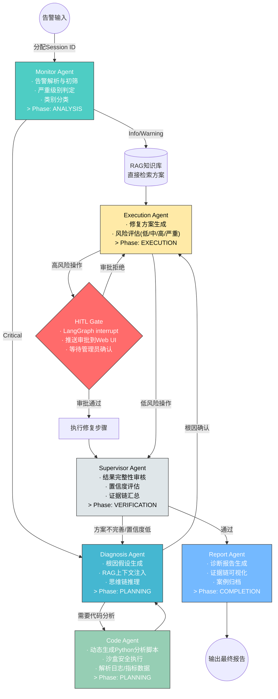

# RAICOM 2026 -- 大模型及智能体应用赛项 -- 项目开发计划

> 企业 IT 运维智能体原型系统

---

## 1. 用户需求

为参加 **2026 睿抗机器人开发者大赛 (RAICOM) - CAIP 强脑赛道 - 大模型及智能体应用赛项**，开发一套面向**企业 IT 运维场景**的智能体原型系统。

### 1.1 参赛信息

- **组别**：本科组
- **团队配置**：<= 2 名学生 + 2 名指导教师
- **技术水平**：已有大模型项目经验，需针对比赛做强化训练
- **目标场景**：企业 IT 运维

### 1.2 核心功能模块

1. **IT 运维知识库（RAG）** -- 加载运维手册、故障处理 SOP、配置模板文档，构建向量数据库，实现混合检索（BM25 + 向量 + RRF 融合）智能语义问答。
2. **智能告警分析** -- 接收服务器/网络告警信息，自动解析告警内容，判断严重级别，输出根因分析和推荐处理方案。支持置信度门限分层处理。
3. **多智能体协作诊断** -- 基于 LangGraph 实现五角色智能体协作链路：Monitor -> Diagnosis -> Code -> Execution -> Supervisor，支持 HITL 人工审批中断。
4. **自动化工单处理** -- 工单自动分类、关键信息抽取、方案推荐、状态流转，支持 Session ID 案例生命周期管理。
5. **安全合规审计** -- 全操作审计日志记录、基于角色的权限验证、高危操作审批拦截、证据链可视化。

### 1.3 视觉交互效果

- 基于 Streamlit 的运维控制台，左侧导航栏切换功能模块
- 运维驾驶舱：系统健康大盘 + 活跃告警统计 + 智能体运行状态
- 拓扑流转图：Monitor -> Diagnosis -> Code -> Execution -> Supervisor 实时状态可视化
- 告警面板以卡片 + 颜色标记展示严重级别
- 诊断过程以流程图/步骤链 + 证据链时间线形式可视化
- 知识库检索以对话式界面呈现，带来源引用标注
- 审计日志以表格 + 筛选器展示，支持操作追踪

---

## 2. 开源项目对照与架构精华移植

### 2.1 三大参考项目对照表

| 能力维度 | OpenDerisk | AIOps-Agent (eyanaouel) | Sentinel AIOps Agent | 本项目移植策略 |
| --- | --- | --- | --- | --- |
| Agent 角色 | 5 角色（SRE/Code/Data/Report/Vis） | 单 Agent 任务规划器 | 编排器 + 推理 + 执行 | 5 角色：Monitor/Diagnosis/Code/Execution/Supervisor |
| 协作模式 | ReAct 循环 + 顺序委托/并行/层级团队 | LLM 驱动工具调度 | 流水线（采集 -> 关联 -> 推理 -> 执行） | LangGraph StateGraph + ReAct 循环 + Phase 管理 |
| 会话状态 | AgentContext（conv_id / conv_session_id / PhaseManager） | 单次请求 | 事件生命周期 | 统一 DiagnosisState + Session ID + Phase 追踪 |
| RAG 检索 | KnowledgeSearch 动作 + ChromaDB | ChromaDB + SentenceTransformers | 向量记忆库 | BM25 + 向量 + RRF 融合 + 重排序 |
| 工具调用 | MCP 协议 + Function Calling | OpenStack SDK / Ansible / K8s 真实 API | 自动化执行器 | 适配层抽象：支持模拟/真实 Ansible/K8s/SSH |
| 安全机制 | 审批拦截 + 沙盒隔离 | 学习引擎审计 | 置信度门限 + 爆炸半径 + 人工审批 | HITL（LangGraph interrupt）+ 高危操作分级审批 |
| 前端可视化 | Vis 协议 + 证据链渲染 | CLI | 交互式仪表盘 | Streamlit 运维驾驶舱 + 拓扑流转图 |
| 上下文压缩 | UnifiedCompactionPipeline（截断 -> 修剪 -> 摘要） | 无 | 无 | LLM 响应缓存 + 对话摘要压缩 |

---

## 3. 技术栈选择

| 层级 | 技术选型 | 选择理由 |
| --- | --- | --- |
| LLM API | OpenAI-compatible API（支持 GPT-4o-mini / DeepSeek / 硅基流动 / 本地 Ollama / AWS Bedrock） | 灵活切换多厂商，符合比赛"软硬协同与工具适配"考核 |
| 智能体框架 | LangChain + LangGraph | 状态图编排 + interrupt 支持 HITL，显式流转，答辩时可视可控 |
| RAG 引擎 | ChromaDB + BM25（rank_bm25）+ RRF + Cross-Encoder 重排序 | 混合检索解决精确术语匹配问题，RRF 是可答辩的技术亮点 |
| 后端框架 | Python FastAPI + Pydantic v2 + SSE 流式 | 高性能异步，自动 OpenAPI 文档，SSE 支持实时诊断流推送 |
| 前端 | Streamlit + Graphviz/Plotly | 快速 UI + 拓扑图可视化，比赛 Demo 展示力强 |
| 日志与审计 | Python logging + JSON Lines 审计存储 + SQLite 案例库 | 轻量可追溯，证据链完整 |
| 文档加载 | LangChain Document Loaders + 自适应分块 | 统一接口，按语义段落智能切分 |

---

## 4. 实现方案

### 4.1 整体策略

采用**分层架构 + 模块化设计**，围绕比赛五大技术挑战维度，参考 OpenDerisk 的 ReAct 多智能体协作模式、AIOps-Agent 的具象化工具封装、Sentinel 的安全分层审批，构建一个涵盖 RAG（含 RRF）、五角色多智能体、提示词工程、HITL 安全合规的完整原型系统。

### 4.2 关键技术决策

1. **LangGraph 五角色 StateGraph + HITL**：Monitor -> Diagnosis -> Code -> Execution -> Supervisor 五节点，支持 LangGraph `interrupt()` 在高危操作前暂停等待人工审批。PhaseManager 追踪任务阶段（分析 -> 规划 -> 执行 -> 验证 -> 完成），借鉴 OpenDerisk 的阶段管理。

2. **RAG 混合检索 + RRF + 重排序（答辩硬核指标）**：BM25 关键词检索 + 向量语义检索 + Reciprocal Rank Fusion（k=60）融合排序 + Cross-Encoder 精排。特别解决运维场景中"错误码精确匹配"（如 ERR_403_AUTH）向量检索容易遗漏的问题。

3. **工具调用具象化（参考 AIOps-Agent）**：工具层分为模拟层和真实适配层。模拟模式直接返回结构化 JSON 用于 Demo 演示；真实模式封装 Ansible Runner、kubectl CLI、paramiko SSH，通过沙箱隔离确保安全。

4. **案例管理 + Session ID 状态持久化（参考 Sentinel + OpenDerisk）**：每个诊断请求分配唯一 Session ID，DiagnosisState 携带 session_id 和 phase，支持跨多轮对话的状态恢复，案例归档至 SQLite 形成历史案例库。

5. **提示词模板化 + 动态注入**：所有场景提示词独立存储，支持根据告警类别动态注入领域知识和工具描述，借鉴 OpenDerisk 的 scene injection（场景注入）机制。

6. **审计日志 + 证据链**：借鉴 OpenDerisk 的 WorkLog 和 Vis 协议，每个 Agent 的推理步骤、工具调用、LLM 响应全部记录，形成可追溯的诊断证据链。

### 4.3 数据流架构

```
用户输入(告警/工单/问题)
    |
    v
+--------------------------------------------------+
|              FastAPI API 层                       |
|  POST /api/alert/analyze                         |
|  POST /api/ticket/process                        |
|  POST /api/rag/query                             |
|  POST /api/diagnosis/run (SSE流式诊断)            |
|  POST /api/diagnosis/{session_id}/approve (HITL) |
|  GET  /api/diagnosis/{session_id}/status         |
|  GET  /api/case/{session_id}/evidence            |
|         | 权限中间件 | 审计中间件                 |
+--------------------------------------------------+
    |
    v
+--------------------------------------------------+
|          Service 业务编排层                       |
|  AlertService / TicketService                    |
|  DiagnosisService (LangGraph编排+Session管理)     |
|  CaseManager (案例生命周期: 创建->运行->审核->完成) |
+--------------------------------------------------+
    |
    v
+--------------------------------------------------+
|      Agent 智能体层 (LangGraph + ReAct)           |
|                                                  |
|  +--------+  +----------+  +----------+         |
|  |Monitor |->|Diagnosis  |->|  Code    |         |
|  |Agent   |  |Agent     |  |Agent     |         |
|  +--------+  +----------+  +----------+         |
|      |             |              |              |
|  +------------------------------------+          |
|  |       Execution Agent              |          |
|  |  +------------------------------+  |          |
|  |  |  HITL Gate (interrupt)       |  |          |
|  |  |  高危操作 -> 等待人工审批     |  |          |
|  |  +------------------------------+  |          |
|  +------------------------------------+          |
|      |                                           |
|  +--------------------------+                    |
|  |  Supervisor Agent         |                    |
|  |  审核->决定重试/流转/结束  |                    |
|  +--------------------------+                    |
|              |                                    |
|     +--------+--------+                          |
|     |   Tools 工具层   |                          |
|     | +--------------+ |                          |
|     | | LogParser    | |                          |
|     | | SystemCheck  | |  <- 模拟模式: JSON返回   |
|     | | AnsibleRun   | |  <- 真实模式: ansible-runner |
|     | | K8sExecutor  | |  <- 真实模式: kubectl    |
|     | | SSHTool      | |  <- 真实模式: paramiko   |
|     | | TicketAction | |                          |
|     | +--------------+ |                          |
|     +-----------------+                          |
+--------------------------------------------------+
    |
    v
+--------------------------------------------------+
|        RAG 知识检索层（RRF混合检索）               |
|  DocumentLoader -> ChunkSplitter                 |
|  -> Embedding(BGE-M3/OpenAI) -> ChromaDB         |
|  -> BM25Index + VectorRetriever                  |
|  -> RRF(k=60) 融合排序 -> CrossEncoder重排序      |
|  -> Context Assembly -> LLM生成（带来源引用）      |
+--------------------------------------------------+
    |
    v
+--------------------------------------------------+
|         LLM API 调用层                            |
|  OpenAI-compatible API (多Provider适配)           |
+--------------------------------------------------+
```

### 4.4 多智能体协作流程（LangGraph StateGraph）



### 4.5 PhaseManager 任务阶段追踪

```
ANALYSIS -> PLANNING -> EXECUTION -> VERIFICATION -> COMPLETION
    |            |            |              |               |
  Monitor    Diagnosis    Execution     Supervisor        Report
  Agent       Agent         Agent         Agent           Agent
```

---

## 5. 九阶段开发计划

### 阶段 1：项目骨架与环境适配

**目标**：搭建完整项目结构，实现多 Provider LLM 统一适配层

**目录结构**：

```
D:/Project/RAICOM/
├── README.md
├── requirements.txt
├── .env.example                    # 多Provider配置(Ollama/Bedrock/硅基流动/DeepSeek/OpenAI)
├── config/
│   └── settings.py                 # Pydantic Settings: Provider切换, 工具模式, RRF参数k
├── src/
│   ├── __init__.py
│   ├── main.py                     # FastAPI入口 + SSE支持
│   ├── api/
│   │   ├── __init__.py
│   │   ├── deps.py                 # 依赖注入 + Session管理器
│   │   ├── routes/
│   │   │   ├── __init__.py
│   │   │   ├── alert.py
│   │   │   ├── ticket.py
│   │   │   ├── diagnosis.py        # SSE流式 + HITL审批端点
│   │   │   ├── rag.py              # RRF参数可配置
│   │   │   └── case.py             # 案例管理: 生命周期查询+证据链
│   │   └── middleware/
│   │       ├── __init__.py
│   │       ├── auth.py
│   │       └── audit.py
│   ├── agents/
│   │   ├── __init__.py
│   │   ├── base_agent.py           # ReAct循环 + Phase追踪
│   │   ├── monitor_agent.py
│   │   ├── diagnosis_agent.py
│   │   ├── code_agent.py           # 代码Agent: 沙盒Python脚本执行
│   │   ├── execution_agent.py      # HITL Gate + 风险评估
│   │   ├── supervisor_agent.py
│   │   ├── report_agent.py         # 报告Agent: 证据链汇总+格式化
│   │   ├── graph.py                # 5节点+interrupt+HITL条件边
│   │   ├── phasemanager.py         # 阶段追踪器
│   │   └── session.py              # Session管理器: 状态持久化+恢复
│   ├── rag/
│   │   ├── __init__.py
│   │   ├── document_loader.py
│   │   ├── chunk_splitter.py       # 自适应分块器
│   │   ├── embedding.py            # 多Embedding Provider支持
│   │   ├── vector_store.py         # ChromaDB持久化
│   │   ├── bm25_index.py           # BM25关键词索引
│   │   ├── retriever.py            # RRF融合+重排序管道
│   │   └── reranker.py             # Cross-Encoder重排序器
│   ├── services/
│   │   ├── __init__.py
│   │   ├── alert_service.py
│   │   ├── ticket_service.py
│   │   ├── diagnosis_service.py    # Session管理+SSE流式推送
│   │   └── case_service.py         # 案例生命周期管理
│   ├── tools/
│   │   ├── __init__.py
│   │   ├── base_tool.py            # 工具基类: 统一模拟/真实模式切换
│   │   ├── log_parser.py
│   │   ├── system_check.py
│   │   ├── ansible_executor.py     # Ansible Playbook执行器
│   │   ├── k8s_executor.py         # kubectl命令执行器
│   │   ├── ssh_executor.py         # SSH远程命令执行器
│   │   ├── ticket_action.py
│   │   └── sandbox.py              # Python沙盒执行器(code_agent使用)
│   ├── models/
│   │   ├── __init__.py
│   │   ├── alert.py
│   │   ├── ticket.py
│   │   ├── diagnosis.py            # +session_id, +phase, +evidence_chain
│   │   └── case.py                 # 案例模型: CaseStatus, Evidence
│   └── prompts/
│       ├── __init__.py
│       ├── alert_prompts.py
│       ├── diagnosis_prompts.py    # CoT思维链+Phase引导
│       ├── code_prompts.py         # 代码Agent Python脚本生成提示词
│       ├── ticket_prompts.py
│       ├── rag_prompts.py          # 含来源引用格式要求
│       └── supervisor_prompts.py   # 审核Agent置信度判定+重试决策提示词
├── data/
│   ├── knowledge_base/
│   │   ├── ops_manual.md
│   │   ├── troubleshooting_guide.md
│   │   ├── config_templates.md
│   │   ├── security_policy.md
│   │   └── error_codes.md          # 错误码手册（用于BM25精确匹配测试）
│   ├── sandbox/                    # Code Agent沙盒工作目录
│   ├── samples/
│   │   ├── alerts_sample.json
│   │   ├── tickets_sample.json
│   │   └── ansible_playbooks/
│   │       └── restart_service.yml
│   ├── cases/                      # 案例归档存储
│   └── audit/
├── ui/
│   ├── app.py                      # 多页面+驾驶舱+拓扑图
│   ├── pages/
│   │   ├── dashboard.py            # 运维驾驶舱(系统健康大盘)
│   │   ├── alert_analysis.py
│   │   ├── ticket_processing.py
│   │   ├── rag_qa.py
│   │   ├── diagnosis_view.py       # 诊断过程可视化(拓扑流转+证据链)
│   │   ├── approval_queue.py       # HITL审批队列页面
│   │   └── audit_log.py
│   └── components/
│       ├── topology_graph.py       # Graphviz拓扑流转图组件
│       ├── evidence_timeline.py    # 证据链时间线组件
│       ├── risk_badge.py           # 风险等级徽章组件
│       └── phase_indicator.py      # 阶段指示器组件
└── tests/
    ├── __init__.py
    ├── conftest.py                 # 多Provider mock + 沙盒fixture
    ├── test_rag.py                 # RRF融合准确率测试 + BM25精确匹配测试
    ├── test_agents.py              # 五Agent全流程 + HITL中断恢复测试
    ├── test_tools.py               # 工具模拟/真实模式切换测试
    └── test_api.py
```

---

### 阶段 2：IT 运维知识库构建

**目标**：构建 5+ 份 IT 运维知识文档 + ChromaDB 向量索引 + BM25 索引

**文档清单**：

| 文档 | 内容 | 分块策略 |
| --- | --- | --- |
| `ops_manual.md` | 服务启停、监控指标、Nginx/Docker/K8s 配置 | 按章节（~500 token） |
| `troubleshooting_guide.md` | CPU/内存/磁盘/网络故障处理 SOP | 按步骤流程（~400 token） |
| `config_templates.md` | Nginx、Dockerfile、K8s YAML 示例 | 按配置块（~600 token） |
| `security_policy.md` | 访问控制、变更管理、合规要求 | 按策略条目（~300 token） |
| `error_codes.md` | 常见 HTTP/系统/应用错误码对照表（ERR_403_AUTH, EMFILE, OOM_KILLED 等） | 按错误码（~200 token，小块） |

**关键实现**：

- 自适应分块：`error_codes.md` 使用 200 token 小块保证精确匹配；SOP 文档使用 500 token 中等块保证上下文完整
- BM25 索引：双索引（中文 jieba 分词 + 英文标准分词），确保"ERR_403_AUTH"这种错误码能被精确召回
- 知识库构建完毕后，用样本告警数据测试召回率

---

### 阶段 3：RAG 混合检索管道

**目标**：实现 BM25 + 向量 + RRF + Cross-Encoder 重排序的完整检索管道

**RRF 算法核心实现**（答辩技术亮点）：

```python
# src/rag/retriever.py

from typing import List, Dict
from langchain_core.documents import Document

def reciprocal_rank_fusion(
    result_sets: List[List[Document]],
    k: int = 60
) -> List[Document]:
    """
    Reciprocal Rank Fusion (RRF) 混合检索融合算法

    原理：score(d) = Sigma 1/(k + rank_i(d))
    其中 rank_i(d) 是文档 d 在第 i 个检索器中的排名

    为什么 k=60？
    - k 越大，多路检索贡献越均衡
    - k=60 是业界经验最优值（参考 Azure AI Search / Elastic）

    运维场景价值：
    - 向量检索擅长"CPU使用率过高"语义匹配
    - BM25 擅长"ERR_403_AUTH"精确错误码匹配
    - RRF 让两者互补，不偏废任何一方
    """
    doc_scores: Dict[str, dict] = {}

    for retriever_name, retriever_results in result_sets:
        for rank, doc in enumerate(retriever_results, start=1):
            doc_id = doc.metadata.get("source", "") + "::" + str(doc.metadata.get("chunk_index", rank))

            if doc_id not in doc_scores:
                doc_scores[doc_id] = {"doc": doc, "rrf_score": 0.0}

            # RRF核心公式
            doc_scores[doc_id]["rrf_score"] += 1.0 / (k + rank)

    # 按 RRF 综合分数降序排列
    fused = sorted(doc_scores.values(), key=lambda x: x["rrf_score"], reverse=True)
    return [item["doc"] for item in fused]
```

**混合检索管道架构**：

```
用户 Query "ERR_403_AUTH导致CPU飙升"
    |
    +---> [BM25 Index] ---> Top-10 关键词匹配结果
    |     (jieba分词+英文分词)        |
    |                         RRF(k=60) 融合排序
    +---> [ChromaDB] ------> Top-10 语义检索结果 ---> Top-5 候选
    |     (BGE-M3 Embedding)                           |
    |                                        [Cross-Encoder 重排序]
    |                                        (bge-reranker-v2-m3)
    |                                                  |
    +----------------------------------------------------> 最终 Top-3 上下文 -> LLM 生成
```

**验收指标**：

- 错误码精确匹配召回率 >= 95%（如查询"ERR_403_AUTH"必须召回错误码文档）
- 语义相关召回率 >= 85%（如查询"磁盘满了怎么办"召回磁盘处理 SOP）
- RRF 融合后 Top-5 包含正确答案的比例 >= 90%

---

### 阶段 4：多智能体框架（五角色 + Phase 管理 + ReAct 循环）

**目标**：基于 LangGraph 实现五角色 StateGraph，借鉴 OpenDerisk 的 ReAct 模式和 PhaseManager

**增强版 AgentState 定义**（精确状态流转）：

```python
# src/agents/graph.py

from typing import TypedDict, List, Optional
from langgraph.types import interrupt  # HITL关键API
from pydantic import BaseModel
from enum import Enum

class Phase(str, Enum):
    """任务阶段 -- 借鉴 OpenDerisk PhaseManager"""
    ANALYSIS = "analysis"           # Monitor 告警分析
    PLANNING = "planning"           # Diagnosis + Code 诊断规划
    EXECUTION = "execution"         # Execution 修复执行
    VERIFICATION = "verification"   # Supervisor 结果审核
    COMPLETION = "completion"       # Report 报告生成
    WAITING_APPROVAL = "waiting_approval"  # HITL 等待人工审批

class Role(str, Enum):
    """智能体角色"""
    MONITOR = "monitor"
    DIAGNOSIS = "diagnosis"
    CODE = "code"
    EXECUTION = "execution"
    SUPERVISOR = "supervisor"
    REPORT = "report"

class EvidenceItem(BaseModel):
    """证据链条目 -- 借鉴 OpenDerisk WorkLog"""
    agent: Role
    timestamp: str
    action: str              # "tool_call" | "llm_reasoning" | "knowledge_retrieval"
    detail: str              # 具体内容摘要
    result: Optional[str] = None

class DiagnosisState(TypedDict):
    # ---- 会话标识（借鉴 OpenDerisk AgentContext）----
    session_id: str                          # UUID，唯一标识一次诊断会话
    phase: Phase                             # 当前阶段

    # ---- 输入数据 ----
    alert: dict                              # 原始告警信息
    user_context: Optional[str]              # 用户附加上下文

    # ---- Monitor Agent 产出 ----
    severity: str                            # Critical / Warning / Info
    category: str                            # CPU / Memory / Disk / Network / Application
    alert_summary: str                       # 告警摘要

    # ---- RAG 检索结果 ----
    knowledge_results: List[str]             # RRF混合检索返回的相关文档片段
    knowledge_sources: List[str]             # 检索来源引用

    # ---- Diagnosis Agent 产出 ----
    hypothesis: Optional[str]                # 根因假设
    diagnosis_steps: List[str]               # 诊断步骤记录（思维链）
    confidence_score: float                  # 置信度 0.0-1.0
    need_code_analysis: bool                 # 是否需要Code Agent

    # ---- Code Agent 产出 ----
    code_script: Optional[str]               # 生成的Python分析脚本
    code_result: Optional[str]               # 脚本执行结果

    # ---- Execution Agent 产出 ----
    actions: List[dict]                      # 推荐修复步骤
    risk_level: str                          # low / medium / high / critical
    needs_hitl: bool                         # 是否需要人工审批

    # ---- HITL 状态 ----
    hitl_approved: Optional[bool]            # 审批结果（None=等待中）
    hitl_reason: Optional[str]               # 审批意见

    # ---- Supervisor Agent 产出 ----
    supervisor_review: str                   # 审核意见
    supervisor_decision: str                 # approve / retry / reject

    # ---- Report Agent 产出 ----
    final_output: str                        # 最终诊断报告（Markdown格式）
    evidence_chain: List[dict]               # 完整证据链（操作追溯）

    # ---- 流转控制 ----
    next_step: str                           # 图流转控制
    retry_count: int                         # 重试次数
    error_message: Optional[str]             # 错误信息
```

**LangGraph 图定义（含 HITL 中断）**：

```python
# src/agents/graph.py

from langgraph.graph import StateGraph, END
from langgraph.checkpoint.memory import MemorySaver

def create_diagnosis_graph():
    workflow = StateGraph(DiagnosisState)

    # 注册节点
    workflow.add_node("monitor", monitor_agent.invoke)       # Phase: ANALYSIS
    workflow.add_node("diagnosis", diagnosis_agent.invoke)   # Phase: PLANNING
    workflow.add_node("code", code_agent.invoke)             # Phase: PLANNING (子任务)
    workflow.add_node("execution", execution_agent.invoke)   # Phase: EXECUTION
    workflow.add_node("hitl_gate", hitl_gate)                # HITL中断节点
    workflow.add_node("supervisor", supervisor_agent.invoke) # Phase: VERIFICATION
    workflow.add_node("report", report_agent.invoke)         # Phase: COMPLETION

    # 条件边
    workflow.add_conditional_edges("monitor", route_from_monitor, {
        "direct_execution": "execution",  # Info/Warning -> 直接RAG方案
        "diagnosis": "diagnosis",          # Critical -> 深度诊断
    })

    workflow.add_conditional_edges("diagnosis", route_from_diagnosis, {
        "need_code": "code",               # 需要动态分析 -> Code Agent
        "continue": "execution",           # 根因确认 -> 执行
        "retry": "diagnosis",             # 置信度低 -> 重试诊断
    })

    workflow.add_edge("code", "diagnosis")  # Code Agent 结果返回诊断

    workflow.add_conditional_edges("execution", route_from_execution, {
        "hitl": "hitl_gate",               # 高危操作 -> 人工审批
        "continue": "supervisor",
    })

    workflow.add_conditional_edges("hitl_gate", route_after_hitl, {
        "approved": "execution",            # 继续执行
        "rejected": "supervisor",           # 拒绝->跳到审核
    })

    workflow.add_conditional_edges("supervisor", route_from_supervisor, {
        "approved": "report",
        "retry": "diagnosis",              # 方案不完善->重试
        "rejected": END,
    })

    workflow.add_edge("report", END)
    workflow.set_entry_point("monitor")

    memory = MemorySaver()
    return workflow.compile(checkpointer=memory)
```

**HITL Gate 实现**（高危操作审批）：

```python
# src/agents/graph.py

def hitl_gate(state: DiagnosisState) -> DiagnosisState:
    """
    高危操作人工审批门控
    借鉴 OpenDerisk 的 WAITING 状态 + Sentinel 的安全分层

    LangGraph interrupt 会在此时挂起执行，
    等待外部通过 /api/diagnosis/{session_id}/approve 恢复
    """
    high_risk_actions = [
        a for a in state["actions"]
        if a.get("needs_approval") or a.get("risk_level") == "critical"
    ]

    if not high_risk_actions:
        state["hitl_approved"] = True
        return state

    # 调用 interrupt 挂起执行，前端会收到 SSE 事件并弹出审批按钮
    approval = interrupt({
        "type": "hitl_approval_required",
        "session_id": state["session_id"],
        "actions": high_risk_actions,
        "message": f"检测到 {len(high_risk_actions)} 个高危操作，需要管理员审批",
        "risk_level": state["risk_level"]
    })

    state["hitl_approved"] = approval.get("approved", False)
    state["hitl_reason"] = approval.get("reason", "")
    return state
```

**PhaseManager 阶段追踪器**：

```python
# src/agents/phasemanager.py

from enum import Enum
from datetime import datetime
from typing import Dict, List

class Phase(str, Enum):
    ANALYSIS = "analysis"
    PLANNING = "planning"
    EXECUTION = "execution"
    VERIFICATION = "verification"
    COMPLETION = "completion"
    WAITING_APPROVAL = "waiting_approval"

class PhaseTracker:
    """任务阶段追踪器 -- 记录每个Agent的进入/退出时间戳"""

    def __init__(self, session_id: str):
        self.session_id = session_id
        self.timeline: List[Dict] = []
        self.current_phase: Phase = None

    def transition_to(self, phase: Phase, agent: str):
        """记录阶段转换"""
        now = datetime.now().isoformat()
        entry = {
            "timestamp": now,
            "from_phase": self.current_phase,
            "to_phase": phase,
            "agent": agent,
            "session_id": self.session_id
        }
        self.timeline.append(entry)
        self.current_phase = phase
        return entry

    def get_timeline(self) -> List[Dict]:
        return self.timeline

    def is_completed(self) -> bool:
        return self.current_phase == Phase.COMPLETION
```

**五角色职责矩阵**（借鉴 OpenDerisk 角色分工）：

| 角色 | OpenDerisk 对照 | 职责 | 工具 | Phase |
| --- | --- | --- | --- | --- |
| Monitor | SRE-Agent | 告警接收、严重级别判定、类别分类、初筛升级 | 无 | ANALYSIS |
| Diagnosis | SRE-Agent | 根因假设生成、RAG 上下文注入、CoT 推理、置信度评估 | RAG 检索、日志解析 | PLANNING |
| Code | Code-Agent | 动态生成 Python 脚本分析日志/指标（沙盒执行） | Python 沙盒、数据解析 | PLANNING |
| Execution | -- | 修复方案生成、风险评估、高危操作 HITL 拦截 | Ansible/K8s/SSH/Ticket | EXECUTION |
| Supervisor | -- | 结果完整性审核、置信度验证、重试/流转决策 | 无 | VERIFICATION |
| Report | Report-Agent | 诊断报告生成、证据链可视化、案例归档 | 无 | COMPLETION |

---

### 阶段 5：工具调用层

**目标**：实现模拟/真实双模式工具层，真实模式可安全向系统发送指令

**设计原则**：

- 统一 `BaseTool` 接口，`mode` 参数控制模拟/真实
- 模拟模式返回结构化 JSON，用于 Demo 演示
- 真实模式基于适配器模式封装 Ansible Runner / kubectl / paramiko
- 所有工具调用自动审计记录

**工具基类**：

```python
# src/tools/base_tool.py

from typing import Literal
from langchain_core.tools import BaseTool
from pydantic import BaseModel
from config.settings import settings

class ToolMode(BaseModel):
    """工具执行模式"""
    mode: Literal["simulate", "real"] = "simulate"

    @property
    def is_real(self) -> bool:
        return self.mode == "real" and settings.TOOL_MODE == "real"

class OpsBaseTool(BaseTool):
    """运维工具基类 -- 统一模式切换和审计"""
    tool_mode: ToolMode = ToolMode()

    def _run(self, **kwargs):
        if self.tool_mode.is_real:
            result = self._real_execute(**kwargs)
        else:
            result = self._simulate_execute(**kwargs)
        self._audit(self.name, kwargs, result)
        return result

    def _simulate_execute(self, **kwargs):
        raise NotImplementedError

    def _real_execute(self, **kwargs):
        raise NotImplementedError
```

**Ansible 工具（核心具象化）**：

```python
# src/tools/ansible_executor.py

class AnsibleExecutor(OpsBaseTool):
    """
    Ansible Playbook 执行器

    模拟模式：返回预期执行结果JSON
    真实模式：调用 ansible-runner 执行Playbook（沙盒隔离）

    安全措施（借鉴 Sentinel）：
    - 爆炸半径限制：一次最多操作 N 台主机
    - 高危模块拦截：command/shell 模块需审批
    - 执行后自动回滚检查
    """
    name: str = "ansible_executor"
    description: str = """
    执行 Ansible Playbook 进行配置管理和服务编排。
    输入：playbook_path (str), inventory (str, 可选), extra_vars (dict, 可选)
    输出：执行结果 JSON，包含 host_ok, host_failed, task_results
    """

    def _simulate_execute(self, playbook_path: str, inventory: str = "localhost,", extra_vars: dict = None) -> str:
        return json.dumps({
            "status": "success",
            "stats": {"ok": 3, "changed": 1, "failed": 0, "skipped": 0},
            "plays": [
                {"task": "restart_nginx", "host": "web-server-01", "state": "changed", "rc": 0},
                {"task": "verify_port", "host": "web-server-01", "state": "ok", "msg": "Port 80 is listening"},
            ]
        }, indent=2)

    def _real_execute(self, playbook_path: str, inventory: str = "localhost,", extra_vars: dict = None):
        import ansible_runner
        r = ansible_runner.run(
            private_data_dir=str(settings.SANDBOX_DIR / "ansible"),
            playbook=playbook_path,
            inventory=inventory,
            extravars=extra_vars or {},
            quiet=True
        )
        return json.dumps(r.stats, indent=2)
```

**K8s Executor**：

```python
# src/tools/k8s_executor.py

class K8sExecutor(OpsBaseTool):
    """
    Kubernetes 命令执行器

    安全措施：
    - 白名单命令：只允许 get/describe/logs/top，禁止 exec/delete/apply
    - 命名空间限制：默认限制在非生产 namespace
    - 输出截断：log 命令自动截断到500行
    """
    ALLOWED_VERBS = ["get", "describe", "logs", "top"]
    BLOCKED_VERBS = ["exec", "delete", "apply", "create", "patch", "scale"]

    name: str = "k8s_executor"
    description: str = """
    执行 Kubernetes 查询命令进行 Pod/Service/Deployment 状态检查。
    输入：command (str) - kubectl 命令参数，如 "get pods -n default"
    输出：命令输出字符串
    限制：仅允许只读操作（get/describe/logs/top）
    """

    def _simulate_execute(self, command: str) -> str:
        return json.dumps({
            "command": f"kubectl {command}",
            "output": "NAME                     READY   STATUS    RESTARTS   AGE\nweb-server-7d5f8b9c-abc   1/1     Running   0          3d\n",
            "exit_code": 0
        })

    def _real_execute(self, command: str):
        verb = command.split()[0]
        if verb in self.BLOCKED_VERBS:
            return json.dumps({"error": f"高危命令被拦截: {verb}", "status": "blocked"})

        import subprocess
        result = subprocess.run(
            ["kubectl"] + command.split(),
            capture_output=True, text=True, timeout=30
        )
        return json.dumps({
            "command": f"kubectl {command}",
            "output": result.stdout[:5000],
            "exit_code": result.returncode
        })
```

**SSH Executor**（带安全审计）：

```python
# src/tools/ssh_executor.py

class SSHExecutor(OpsBaseTool):
    """
    SSH 远程命令执行器

    安全措施：
    - 命令白名单/黑名单
    - 目标主机白名单
    - 执行超时强制中断
    - 敏感参数脱敏（密码等不记录到审计日志）
    """
    BLOCKED_PATTERNS = ["rm -rf", "dd if=", "mkfs.", "> /dev/sda", "shutdown", "reboot"]

    name: str = "ssh_executor"
    description: str = """
    通过 SSH 在远程主机执行只读诊断命令。
    输入：host (str), command (str), username (str, 可选)
    输出：命令执行结果
    限制：禁止写入/删除/重启类危险操作
    """

    def _simulate_execute(self, host: str, command: str, username: str = "root") -> str:
        if "df" in command:
            return "/dev/sda1  50G  42G  8G  85% /"
        elif "free" in command:
            return "Mem: 16G used 14G free 2G"
        elif "uptime" in command:
            return "14:30:01 up 30 days, 2:15, 1 user"
        return f"[simulated] {host}: {command} -> OK"

    def _real_execute(self, host: str, command: str, username: str = "root"):
        for pattern in self.BLOCKED_PATTERNS:
            if pattern in command:
                return json.dumps({"error": f"危险命令被拦截: {pattern}", "status": "blocked"})

        import paramiko
        client = paramiko.SSHClient()
        client.set_missing_host_key_policy(paramiko.AutoAddPolicy())
        try:
            client.connect(host, username=username, timeout=10)
            stdin, stdout, stderr = client.exec_command(command, timeout=30)
            return stdout.read().decode()[:5000]
        finally:
            client.close()
```

---

### 阶段 6：业务服务层（Case Management + Session 管理）

**目标**：实现带 Session ID 的状态持久化诊断服务，借鉴 Sentinel 的案例管理

**Session 管理器**：

```python
# src/agents/session.py

class SessionManager:
    """
    Session 生命周期管理 -- 借鉴 OpenDerisk AgentContext + Sentinel Case Management

    状态机流程：
    CREATED -> RUNNING -> WAITING_APPROVAL -> RUNNING -> COMPLETED
                                                  |
                                               FAILED
    """

    def __init__(self):
        self._sessions: Dict[str, DiagnosisState] = {}
        self._case_db = CaseDatabase()

    def create_session(self, alert: dict) -> str:
        session_id = str(uuid.uuid4())
        state = DiagnosisState(
            session_id=session_id,
            phase=Phase.ANALYSIS,
            alert=alert,
        )
        self._sessions[session_id] = state
        self._case_db.create_case(session_id, alert)
        return session_id

    def get_session(self, session_id: str) -> Optional[DiagnosisState]:
        return self._sessions.get(session_id)

    def update_session(self, session_id: str, updates: dict):
        state = self._sessions.get(session_id)
        if state:
            state.update(updates)
            self._case_db.update_case(session_id, updates)

    def archive_case(self, session_id: str):
        state = self._sessions.pop(session_id, None)
        if state:
            self._case_db.archive_case(session_id, state)
```

**诊断编排服务（SSE 流式推送）**：

```python
# src/services/diagnosis_service.py

class DiagnosisService:
    """诊断编排服务 -- LangGraph + SSE + Session管理"""

    async def run_diagnosis_stream(self, session_id: str) -> AsyncGenerator:
        """
        SSE 流式推送诊断过程

        每个 Agent 节点执行后会 yield 一个 SSE 事件：
        - phase_change: 阶段切换（前端更新阶段指示器）
        - agent_think: Agent 推理过程（前端更新思维链）
        - tool_call: 工具调用记录（前端更新证据链）
        - hitl_required: 高危操作审批请求（前端弹窗）
        - final_report: 最终诊断报告
        """
        state = self.session_mgr.get_session(session_id)
        graph = create_diagnosis_graph()
        config = {"configurable": {"thread_id": session_id}}

        async for event in graph.astream(state, config):
            if "phase" in event:
                yield f"data: {json.dumps({'type': 'phase_change', 'phase': event['phase']})}\n\n"
            if "reasoning" in event:
                yield f"data: {json.dumps({'type': 'agent_think', 'agent': event['agent'], 'content': event['reasoning']})}\n\n"
            if "final_output" in event:
                yield f"data: {json.dumps({'type': 'final_report', 'content': event['final_output']})}\n\n"
```

---

### 阶段 7：API + 安全层（HITL 审批端点）

**目标**：FastAPI 六组路由 + 权限中间件 + 审计中间件 + HITL 审批端点

**API 端点设计**：

| 方法 | 路径 | 说明 |
| --- | --- | --- |
| POST | `/api/alert/analyze` | 单次告警分析 |
| POST | `/api/ticket/process` | 工单智能处理 |
| POST | `/api/rag/query` | RAG 知识库问答 |
| POST | `/api/rag/upload` | 上传运维文档 |
| POST | `/api/diagnosis/run` | 启动多智能体诊断（返回 SSE 流） |
| GET | `/api/diagnosis/{session_id}/status` | 查询诊断进度和阶段 |
| POST | `/api/diagnosis/{session_id}/approve` | HITL 审批（resume LangGraph） |
| GET | `/api/case/{session_id}` | 案例详情查询 |
| GET | `/api/case/{session_id}/evidence` | 证据链查询 |
| GET | `/api/cases` | 案例列表（支持筛选） |
| GET | `/api/audit/logs` | 审计日志查询 |

**HITL 审批端点**：

```python
# src/api/routes/diagnosis.py

@router.post("/diagnosis/{session_id}/approve")
async def approve_hitl(
    session_id: str,
    approval: HitlApprovalRequest,
    current_user = Depends(get_current_user)
):
    """
    高危操作审批端点

    审批通过 -> LangGraph resume -> Execution 继续执行
    审批拒绝 -> LangGraph resume -> 跳转到 Supervisor 重新评估
    """
    if current_user.role != "admin":
        raise HTTPException(403, "只有管理员可以审批高危操作")

    await diagnosis_service.resume_with_approval(
        session_id,
        approved=approval.approved,
        reason=approval.reason
    )

    audit_logger.log(
        user=current_user.username,
        action="hitl_approve",
        session_id=session_id,
        detail=approval.dict()
    )

    return {"status": "ok", "approved": approval.approved}
```

---

### 阶段 8：Web 控制台（运维驾驶舱 + 拓扑流转图）

**目标**：Streamlit 多页面控制台，借鉴 AWS 智能运维 + Sentinel 仪表盘

**运维驾驶舱（dashboard.py）**：

- 系统健康大盘：活跃告警数、今日处理工单数、Agent 运行状态
- 最近告警时间线
- 智能体调用统计

**诊断过程可视化（diagnosis_view.py）**：

- 拓扑流转图：Graphviz 渲染 Monitor -> Diagnosis -> Code -> Execution -> Supervisor 实时状态，高亮当前活跃节点
- 阶段指示器：横向步骤条显示 ANALYSIS -> PLANNING -> EXECUTION -> VERIFICATION -> COMPLETION
- 思维链面板：每个 Agent 的思考过程实时流式显示
- 证据链时间线：滚动时间轴展示每个工具调用和 Agent 决策
- HITL 审批弹窗：高危操作时弹出审批按钮

**拓扑图组件**：

```python
# ui/components/topology_graph.py

import graphviz

def render_topology(state: DiagnosisState) -> graphviz.Digraph:
    """
    生成 Agent 协作拓扑图

    当前活跃 Agent 高亮为绿色
    已完成 Agent 显示为灰色
    HITL 等待状态显示为红色
    """
    dot = graphviz.Digraph(comment="Agent Topology")
    dot.attr(rankdir="LR")
    dot.attr("node", fontname="Microsoft YaHei")

    agents = [
        ("Monitor", "monitor"), ("Diagnosis", "diagnosis"),
        ("Code", "code"), ("Execution", "execution"),
        ("Supervisor", "supervisor"), ("Report", "report")
    ]

    current = get_current_agent(state)

    for label, node_id in agents:
        if node_id == current:
            color = "#2ecc71"  # 活跃-绿色
            shape = "doublecircle"
        elif is_completed(state, node_id):
            color = "#bdc3c7"  # 完成-灰色
            shape = "circle"
        else:
            color = "#ecf0f1"  # 等待-浅灰
            shape = "circle"

        dot.node(node_id, label, shape=shape, style="filled", fillcolor=color)

    dot.edge("monitor", "diagnosis")
    dot.edge("monitor", "execution")
    dot.edge("diagnosis", "code", style="dashed")
    dot.edge("code", "diagnosis", style="dashed")
    dot.edge("diagnosis", "execution")
    dot.edge("execution", "supervisor")
    dot.edge("execution", "hitl", label="HITL", color="red", fontcolor="red")
    dot.edge("supervisor", "report")
    dot.edge("supervisor", "diagnosis", label="retry", style="dotted")

    return dot
```

**Streamlit 页面架构**：

```
ui/app.py (主入口)
|-- 侧边栏导航
|   |-- [Dashboard] 运维驾驶舱 (dashboard.py)
|   |-- [Alert] 告警分析 (alert_analysis.py)
|   |-- [Ticket] 工单处理 (ticket_processing.py)
|   |-- [Diagnosis] 智能诊断 (diagnosis_view.py)
|   |   |-- 拓扑流转图
|   |   |-- 阶段指示器
|   |   |-- 思维链面板
|   |   |-- 证据链时间线
|   |-- [Approval] 审批队列 (approval_queue.py)
|   |-- [RAG] 知识库问答 (rag_qa.py)
|   |-- [Audit] 审计日志 (audit_log.py)
```

---

### 阶段 9：测试与性能优化

**目标**：全面测试 + LLM 缓存 + 上下文压缩

**测试清单**：

| 测试项 | 内容 | 标准 |
| --- | --- | --- |
| RRF 召回率 | 错误码精确匹配 + 语义相关 | 精确>=95%, 语义>=85% |
| BM25 vs 向量对比 | 对比单一检索 vs 混合检索 | RRF 混合 > 单一 |
| Agent 全流程 | 五 Agent 端到端诊断 | 覆盖率 100% |
| HITL 中断恢复 | 模拟审批 -> 恢复 -> 继续 | 状态不丢失 |
| 工具模式切换 | simulate/real 双模式 | 无异常 |
| API 集成 | 所有端点 + 异常处理 + 审计 | 全通过 |
| Session 恢复 | 中断后恢复诊断 | 状态一致 |

**性能优化**：

- LLM 响应缓存：相同告警类型 + 严重级别使用 LRU 缓存（TTL=1h）
- 上下文压缩：借鉴 OpenDerisk 的 UnifiedCompactionPipeline，长对话自动截断 -> 修剪 -> 摘要
- 异步管道：全链路 async/await
- 重复检测：借鉴 OpenDerisk 的 IntelligentDoomLoopDetector，检测 Agent 重复工具调用，超 3 次自动中断

---

## 6. 实施注意事项

### 6.1 性能

- ChromaDB 使用 `hnsw:space=cosine` 索引
- LangGraph checkpointer 使用 MemorySaver（MVP）+ 可选 SQLite checkpointer
- 大日志解析使用流式处理
- RRF 算法时间复杂度 O(n*m)，n=检索器数，m=结果数，控制在毫秒级

### 6.2 安全

- HITL 审批是所有高危操作的必经门控
- 工具白名单/黑名单机制
- 沙盒隔离 Code Agent 的 Python 执行
- 审计日志不可篡改（JSON Lines + 签名哈希）
- 敏感参数脱敏记录

### 6.3 兼容性

- LLM Provider 适配器模式，支持 OpenAI / DeepSeek / Ollama / 硅基流动 / Bedrock
- Embedding 模型多 Provider 支持
- 工具层双模式（simulate/real），比赛现场使用 simulate 模式确保稳定
- `.env` 配置集中管理所有切换

### 6.4 答辩亮点准备

1. **RRF 混合检索**：为什么 k=60，能解决什么运维场景问题，对比实验数据
2. **五角色 ReAct 协作**：每个 Agent 的职责边界，PhaseManager 阶段追踪
3. **HITL 高危操作审批**：LangGraph interrupt 机制，安全分层的设计哲学
4. **工具具象化**：Ansible/K8s/SSH 的真实封装，模拟/真实双模式
5. **证据链可视化**：全链路可追溯，符合企业合规要求
6. **Session ID + 案例管理**：多轮对话状态保持，历史案例可检索复用

---

*计划生成时间: 2026-06-09*

*参考项目: OpenDerisk (derisk-ai) / AIOps-Agent (eyanaouel) / Sentinel AIOps Agent (raghulvj01)*
